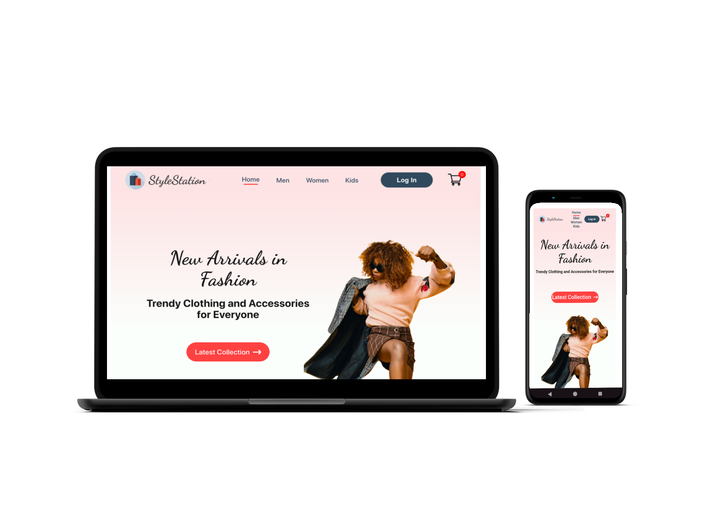
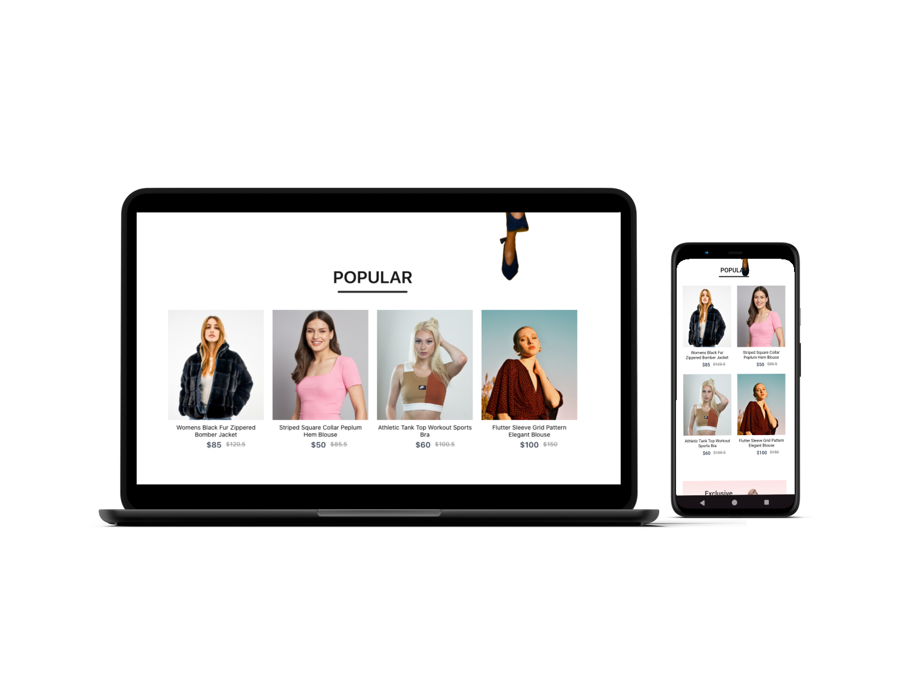
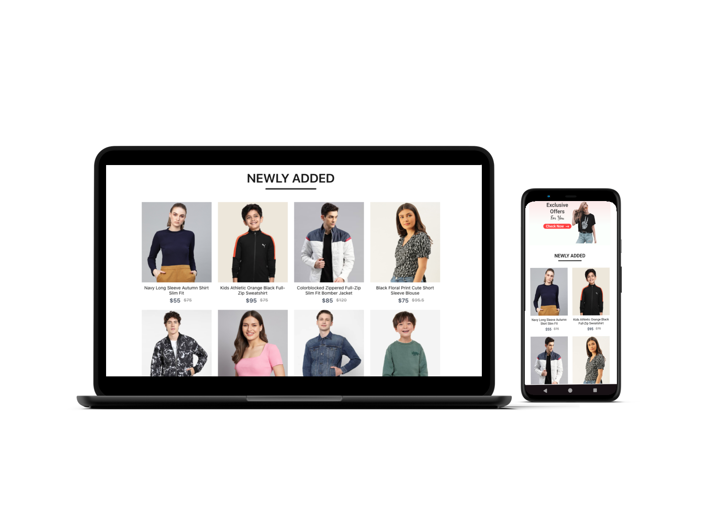
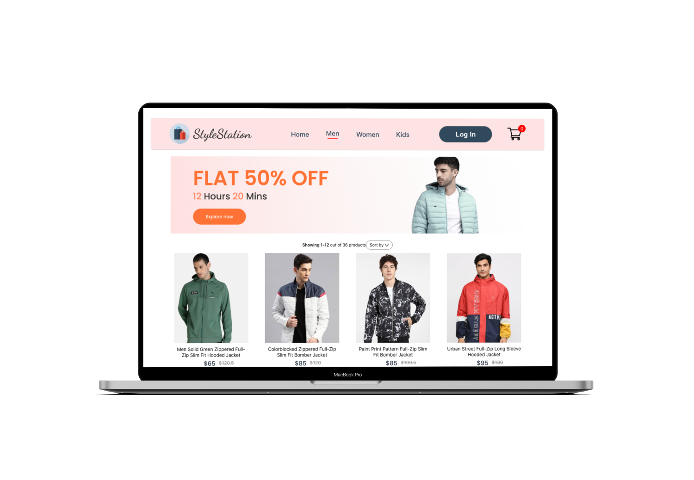
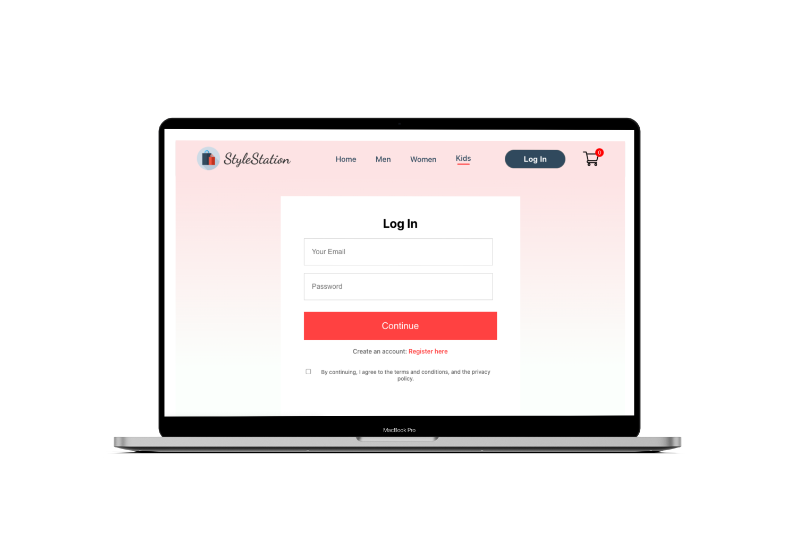
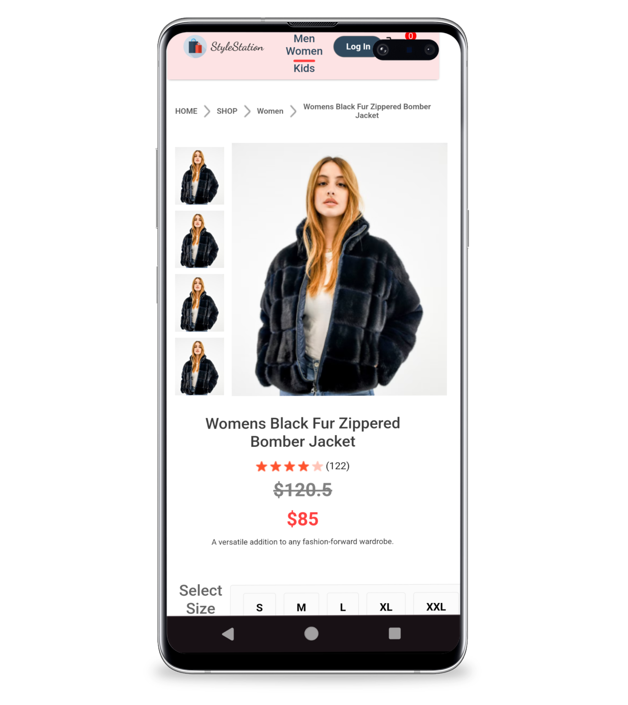
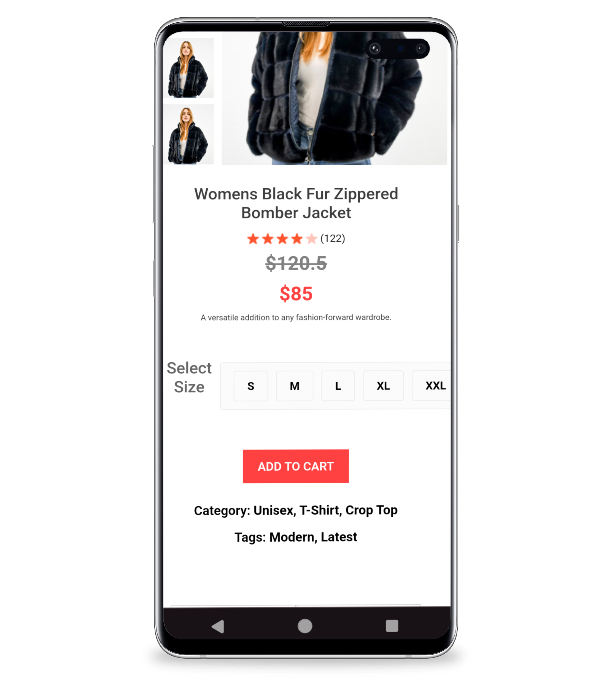
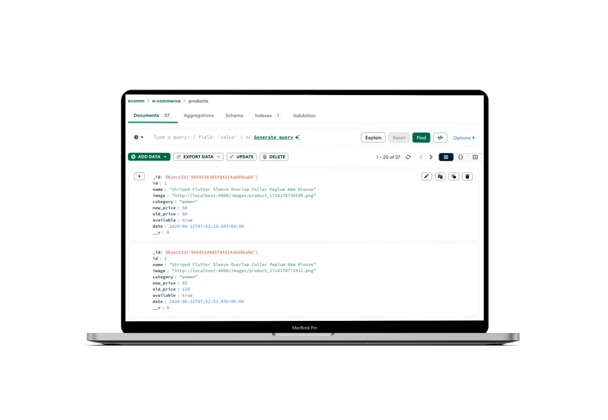

# StyleStation E-Commerce Website

Live (deployed) website here: [StyleStation](https://e-commerce-react-website.onrender.com)

* Note: For demonstration purposes, the deployed website uses static images that have a different source than the images you will find if you download the repository and run it locally. Still, the images are exactly the same so the aesthetics don't change much between repo and the live website. 

**StyleStation** is a clothing shop that sells products for men, women and kids. I used the MERN (MongoDB, Express, React, NodeJS) Stack to create this full-stack web application. It includes user authentication, and the ability to save your cart contents within your personal account. That way, you can pick up where you left off in your browsing!

StyleStation is a fully-responsive application that can be viewed across the largest to smallest screen sizes. I used CSS and media queries to make the website responsive and accessible. React is used to render the page contents. 

## Technical Goals

The primary goal of this project was to enhance understanding and proficiency in several key areas of web development:

1. **MERN Stack Mastery**: Building a robust and scalable application using MongoDB, Express.js, React, and Node.js.
2. **Responsive and Accessible Website**: Utilizing media-queries to create visually appealing and user-friendly interactions.
3. **Secure Authentication with JWT**: Implementing JWT Authentication to ensure reliable user login and registration processes.
4. **Efficient Media Management with Multer**: Integrating Multer for efficient handling and optimization of images.
5. **DRY Coding Practices**: I wanted to adhere to DRY coding principles and prevent redundancy.

| Product Display |  |
| ------------- | ------------- |
|  |  |

## Features

- **User Login/Registration**: I used Fetch to make API calls to obtain data for products, users, and used JSON Web Tokens to allow for user authentication. Each user has their own unique auth-token that is saved to the database.
- **Local Storage Engine with Multer**: I used the Express package `multer` to be able to upload my own images into a local storage engine and then created URL paths that can be stored into the database. 
- **CRUD / REST API Methodology**: I used CRUD/ RESTful API methods to create product data, read product data, update cart data, and delete cart data. I used Thunder Client Extension in VSCode to test GET, POST, PUT and DELETE request and response routes to ensure they worked as intended.
- **Notification System**: Cart tracker adds instant update to show how much you have in your cart from any page.
- **Admin GUI**: I created a separate Admin GUI (Graphical User Interface) where the user can upload their own products to the database (adhering to the Product schema), but for the sake of this project I did not include it in the live site deployment because I didn't want anyone to tamper with the database entries. If you view/download this repository you can view this folder titled 'admin'. 

## Examples of API Endpoints

### **Backend Management**

### **1. Get Cart Data**

- **Endpoint:** **`POST /getcart`**
- **Description:** Fetches saved cart data

### **2. Update Cart Data**

- **Endpoint:** **`PUT /addtocart`**
- **Description:** Adds a new item to the cart 

### **3. Remove From Cart**

- **Endpoint:**  **`DELETE /removefromcart`**
- **Description:** Removes the product from the cart.

## Database Structure
This an example of how the database products are structured.

## Wireframes Examples
| Shop Page | Cart Page |
| ------------- | ------------- |
|  |  |

### Agile Methodology

My project utilizes agile methodology to ensure iterative development, continuous feedback, and rapid adaptation to changes. Duration of project development: two weeks.

### Technologies Used:
- HTML
- CSS
- JavaScript
- React
- Vite
- Express 
- MongoDB
- NodeJS

### Dependencies
In order to run both the frontend and backend successfully, these dependencies must be installed using `npm install`:
* "react"
* "react-dom"
* "react-router-dom"
* "cors"
* "dotenv"
* "express"
* "jsonwebtoken"
* "mongoose"
* "multer"
* "path"

I used Vite to create the React environment. To use Vite you must run the command:
`$ npm create vite@latest`

and then `$ npm run dev` in your chosen directory.

## Challenges Addressed

1. **Mapping List Products**: I needed to learn how to make sure the products listed how I wanted them to across all pages without errors.
2. **Profile Creation**: Facilitated seamless profile creation for users, ensuring all necessary information is captured and easily manageable.
3. **Eliminating 'Undefined' Errors when Fetching Product**:  I learned how to write optional chaining in React using the '?.' operator to determine whether the value of an object is truthy or falsy. By using this operator, it helped me to avoid any of my code values returning "undefined" React errors.

## Overall Reflection

This was a complex project that used multiple React hooks such as UseRef, UseState, UseContext, useEffect and many JSX Components.

I added creative elements and a personal touch to my project through the use of CSS styling. I love using CSS and enjoyed the opportunity to use both grid and flex displays interchangeably. I believe I delivered an engaging experience to the end-user, by giving the opportunity to browse through multiple shop categories as if it were an actual clothing shop.

### Future Goals

Write functional JSX logic for all visual elements on the pages. For example, there are some placeholder buttons and text that I would love to make dynamic and/or functional in the future.

